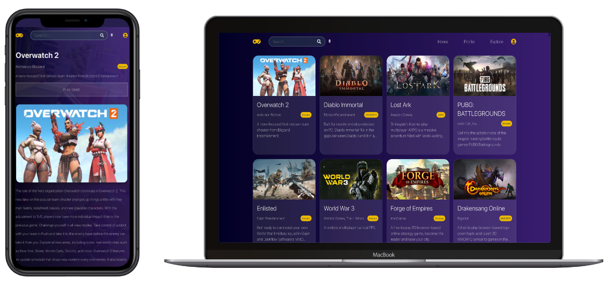

<div align="center">


</div>

## Summary
  - [1. Introduction](#1-introduction)
  - [2. Live Preview](#2-live-preview)
  - [3. Technologies](#3-technologies)
  - [4. Installing and Running](#4-installing-and-running)
  - [5. References](#5-references)


## 1. Introduction
See lists and details of your favorite games. It was developed for 3 days challenge.
### 1.2. Features
- Game list;
- Game details;
- Search by name, description, type, platform and publisher;
- Sort by name;
- Components skeleton while loading;
- Carousel with screenshots;
- Search when click in attributes;
- Responsivity;
- Redirect to game page;

<div align="center">

https://youtu.be/tHMbcTnPXSo

[](https://www.youtube.com/watch?v=tHMbcTnPXSo "Video demo.")

_Video demo._
</div>

## 2. Live Preview
- Production: [https://games.lucasgabriel.com.br/](https://games.lucasgabriel.com.br/)


## 3. Technologies
- [ReactJS](https://reactjs.org/) _[1]_
- [Styled Components](https://styled-components.com/) _[2]_
- [Typescript](https://www.typescriptlang.org/) _[3]_
- [Netlify](https://www.netlify.com/) _[4]_
- [Free To Game API](https://www.freetogame.com/api-doc/) _[5]_


## 4. Installing and Running
- Clone this repo:
```
git clone git@github.com:90lucasgabriel/games_challenge.git
```
- Access directory:
```
cd games_challenge
```
- Install dependencies:
```
yarn
```
- Create and setup environment files:
```
/.env
REACT_APP_X_RAPIDAPI_KEY=6db00c4724msh2b533c10bc09cc9p1729b2jsn36f171f12e72
```
- Run
```
yarn start
```
- Access (Browser)
```
localhost:3000
```


## 5. References
[1] React - Avaiable on https://reactjs.org/;

[2] Styled Components - Available on https://styled-components.com/;

[3] Typescript - Available on https://www.typescriptlang.org/;

[4] Netlify - Available on https://www.netlify.com/;

[5] Free To Game API - Available on https://www.freetogame.com/api-doc/;
